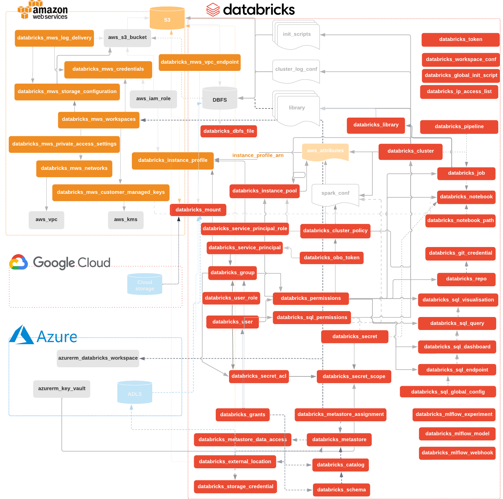

# Databricks Terraform Provider



[Troubleshooting Guide](docs/guides/troubleshooting.md)
| [AWS](docs/guides/aws-workspace.md) tutorial
| [Azure](docs/guides/azure-workspace.md) tutorial
| [End-to-end](docs/guides/workspace-management.md) tutorial
| [Changelog](CHANGELOG.md)
| [Authentication](docs/index.md)
| [databricks_aws_assume_role_policy](docs/data-sources/aws_assume_role_policy.md) data
| [databricks_aws_bucket_policy](docs/data-sources/aws_bucket_policy.md) data
| [databricks_aws_crossaccount_policy](docs/data-sources/aws_crossaccount_policy.md) data
| [databricks_catalog](docs/resources/catalog.md)
| [databricks_catalogs](docs/data-sources/catalog.md) data
| [databricks_cluster](docs/resources/cluster.md)
| [databricks_clusters](docs/data-sources/clusters.md) data
| [databricks_cluster_policy](docs/resources/cluster_policy.md)
| [databricks_current_user](docs/data-sources/current_user.md)
| [databricks_dbfs_file](docs/resources/dbfs_file.md)
| [databricks_dbfs_file_paths](docs/data-sources/dbfs_file_paths.md) data
| [databricks_dbfs_file](docs/data-sources/dbfs_file.md) data
| [databricks_directory](docs/resources/directory.md)
| [databricks_external_location](docs/resources/external_location.md)
| [databricks_git_credential](docs/resources/git_credential.md)
| [databricks_global_init_script](docs/resources/global_init_script.md)
| [databricks_grants](docs/resources/grants.md)
| [databricks_group](docs/resources/group.md)
| [databricks_group](docs/data-sources/group.md) data
| [databricks_group_instance_profile](docs/resources/group_instance_profile.md)
| [databricks_group_member](docs/resources/group_member.md)
| [databricks_instance_pool](docs/resources/instance_pool.md)
| [databricks_instance_profile](docs/resources/instance_profile.md)
| [databricks_ip_access_list](docs/resources/ip_access_list.md)
| [databricks_job](docs/resources/job.md)
| [databricks_job](docs/data-sources/job.md) data
| [databricks_jobs](docs/data-sources/jobs.md)
| [databricks_library](docs/resources/library.md)
| [databricks_metastore](docs/resources/metastore.md)
| [databricks_metastore_assignment](docs/resources/metastore_assignment.md)
| [databricks_metastore_data_access](docs/resources/metastore_data_access.md)
| [databricks_mlflow_model](docs/resources/mlflow_model.md)
| [databricks_mlflow_experiment](docs/resources/mlflow_experiment.md)
| [databricks_mlflow_webhook](docs/resources/mlflow_webhook.md)
| [databricks_mount](docs/resources/mount.md)
| [databricks_mws_credentials](docs/resources/mws_credentials.md)
| [databricks_mws_customer_managed_keys](docs/resources/mws_customer_managed_keys.md)
| [databricks_mws_log_delivery](docs/resources/mws_log_delivery.md)
| [databricks_mws_networks](docs/resources/mws_networks.md)
| [databricks_mws_permission_assignment](docs/resources/mws_permission_assignment.md)
| [databricks_mws_private_access_settings](docs/resources/mws_private_access_settings.md)
| [databricks_mws_storage_configurations](docs/resources/mws_storage_configurations.md)
| [databricks_mws_vpc_endpoint](docs/resources/mws_vpc_endpoint.md)
| [databricks_mws_workspaces](docs/resources/mws_workspaces.md)
| [databricks_mws_workspaces](docs/data-sources/mws_workspaces.md) data
| [databricks_node_type](docs/data-sources/node_type.md) data
| [databricks_notebook](docs/resources/notebook.md)
| [databricks_notebook](docs/data-sources/notebook.md) data
| [databricks_notebook_paths](docs/data-sources/notebook_paths.md) data
| [databricks_obo_token](docs/resources/obo_token.md)
| [databricks_permissions](docs/resources/permissions.md)
| [databricks_pipeline](docs/resources/pipeline.md)
| [databricks_repo](docs/resources/repo.md)
| [databricks_schema](docs/resources/schema.md)
| [databricks_schemas](docs/data-sources/schema.md) data
| [databricks_secret](docs/resources/secret.md)
| [databricks_secret_acl](docs/resources/secret_acl.md)
| [databricks_secret_scope](docs/resources/secret_scope.md)
| [databricks_service_principal](docs/resources/service_principal.md)
| [databricks_service_principals](docs/data-sources/service_principals.md) data
| [databricks_service_principal_role](docs/resources/service_principal_role.md)
| [databricks_spark_version](docs/data-sources/spark_version.md) data
| [databricks_sql_dashboard](docs/resources/sql_dashboard.md)
| [databricks_sql_endpoint](docs/resources/sql_endpoint.md)
| [databricks_sql_global_config](docs/resources/sql_global_config.md)
| [databricks_sql_permissions](docs/resources/sql_permissions.md)
| [databricks_sql_query](docs/resources/sql_query.md)
| [databricks_sql_visualization](docs/resources/sql_visualization.md)
| [databricks_sql_warehouse](docs/data-sources/sql_warehouse.md) data
| [databricks_sql_warehouses](docs/data-sources/sql_warehouses.md) data
| [databricks_sql_widget](docs/resources/sql_widget.md)
| [databricks_storage_credential](docs/resources/storage_credential.md)
| [databricks_tables](docs/data-sources/tables.md) data
| [databricks_token](docs/resources/token.md)
| [databricks_user](docs/resources/user.md)
| [databricks_user_role](docs/resources/user_role.md)
| [databricks_user_instance_profile](docs/resources/user_instance_profile.md)
| [databricks_views](docs/data-sources/views.md) data
| [databricks_workspace_conf](docs/resources/workspace_conf.md)
| [databricks_zones](docs/data-sources/zones.md)
| [Contributing and Development Guidelines](CONTRIBUTING.md)

[](https://github.com/databricks/terraform-provider-databricks/actions?query=workflow%3Abuild+branch%3Amaster) [](https://codecov.io/gh/databricks/terraform-provider-databricks)  [](https://hanadigital.github.io/grev/?user=databricks&repo=terraform-provider-databricks)

If you use Terraform 0.13 or newer, please refer to instructions specified at [registry page](https://registry.terraform.io/providers/databricks/databricks/latest). If you use older versions of Terraform or want to build it from sources, please refer to [contributing guidelines](CONTRIBUTING.md) page.

```hcl
terraform {
  required_providers {
    databricks = {
      source  = "databricks/databricks"
      version = "1.6.5"
    }
  }
}
```

Then create a small sample file, named `main.tf` with approximately following contents. Replace `<your PAT token>` with newly created [PAT Token](https://docs.databricks.com/dev-tools/api/latest/authentication.html). 

```terraform
provider "databricks" {
  host  = "https://abc-defg-024.cloud.databricks.com/"
  token = "<your PAT token>"
}

data "databricks_current_user" "me" {}
data "databricks_spark_version" "latest" {}
data "databricks_node_type" "smallest" {
  local_disk = true
}

resource "databricks_notebook" "this" {
  path     = "${data.databricks_current_user.me.home}/Terraform"
  language = "PYTHON"
  content_base64 = base64encode(<<-EOT
    # created from ${abspath(path.module)}
    display(spark.range(10))
    EOT
  )
}

resource "databricks_job" "this" {
  name = "Terraform Demo (${data.databricks_current_user.me.alphanumeric})"

  new_cluster {
    num_workers   = 1
    spark_version = data.databricks_spark_version.latest.id
    node_type_id  = data.databricks_node_type.smallest.id
  }

  notebook_task {
    notebook_path = databricks_notebook.this.path
  }
}

output "notebook_url" {
  value = databricks_notebook.this.url
}

output "job_url" {
  value = databricks_job.this.url
}
```

Then run `terraform init` then `terraform apply` to apply the hcl code to your Databricks workspace. 

# Switching from `databrickslabs` to `databricks` namespace

To make Databricks Terraform Provider generally available, we've moved it from [https://github.com/databrickslabs](https://github.com/databrickslabs) to [https://github.com/databricks](https://github.com/databricks). We've worked closely with the Terraform Registry team at Hashicorp to ensure a smooth migration. Existing terraform deployments continue to work as expected without any action from your side. We ask you to replace `databrickslabs/databricks` with `databricks/databricks` in all your `.tf` files. 

You should have [`.terraform.lock.hcl`](https://github.com/databrickslabs/terraform-provider-databricks/blob/v0.6.2/scripts/versions-lock.hcl) file in your state directory that is checked into source control. terraform init will give you the following warning.

```
Warning: Additional provider information from registry 

The remote registry returned warnings for registry.terraform.io/databrickslabs/databricks:
- For users on Terraform 0.13 or greater, this provider has moved to databricks/databricks. Please update your source in required_providers.
```

After you replace `databrickslabs/databricks` with `databricks/databricks` in the `required_providers` block, the warning will disappear. Do a global "search and replace" in `*.tf` files. Alternatively you can run `python3 -c "$(curl -Ls https://dbricks.co/updtfns)"` from the command-line, that would do all the boring work for you.

If you didn't check-in [`.terraform.lock.hcl`](https://www.terraform.io/language/files/dependency-lock#lock-file-location) to the source code version control, you may you may see `Failed to install provider` error. Please follow the simple steps described in the [troubleshooting guide](docs/guides/troubleshooting.md).
