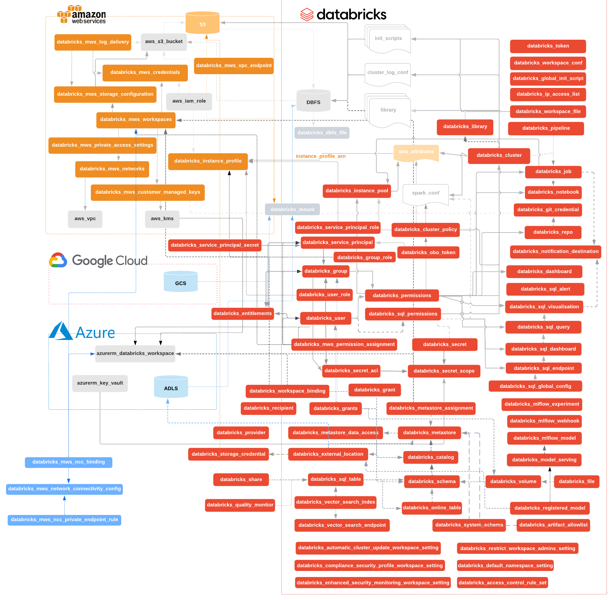

# Databricks Terraform Provider



[AWS](docs/guides/aws-workspace.md) tutorial
| [Azure](docs/guides/azure-workspace.md) tutorial
| [End-to-end](docs/guides/workspace-management.md) tutorial
| [Authentication](docs/index.md)
| [Troubleshooting Guide](docs/guides/troubleshooting.md)
| [Changelog](CHANGELOG.md)
| [Contributing and Development Guidelines](CONTRIBUTING.md)

[](https://github.com/databricks/terraform-provider-databricks/actions?query=workflow%3Abuild+branch%3Amain) [](https://codecov.io/gh/databricks/terraform-provider-databricks) [](https://hanadigital.github.io/grev/?user=databricks&repo=terraform-provider-databricks)

Databricks Terraform provider works with Terraform 1.1.5 or newer. To use it please refer to instructions specified at [registry page](https://registry.terraform.io/providers/databricks/databricks/latest):

```hcl
terraform {
  required_providers {
    databricks = {
      source = "databricks/databricks"
    }
  }
}
```

If you want to build it from sources, please refer to [contributing guidelines](CONTRIBUTING.md).

Then create a small sample file, named `main.tf` with approximately following contents. Replace `<your PAT token>` with newly created [PAT Token](https://docs.databricks.com/dev-tools/api/latest/authentication.html).

```terraform
provider "databricks" {
  host  = "https://abc-defg-024.cloud.databricks.com/"
  token = "<your PAT token>"
}

data "databricks_current_user" "me" {}
data "databricks_spark_version" "latest" {}
data "databricks_node_type" "smallest" {
  local_disk = true
}

resource "databricks_notebook" "this" {
  path     = "${data.databricks_current_user.me.home}/Terraform"
  language = "PYTHON"
  content_base64 = base64encode(<<-EOT
    # created from ${abspath(path.module)}
    display(spark.range(10))
    EOT
  )
}

resource "databricks_job" "this" {
  name = "Terraform Demo (${data.databricks_current_user.me.alphanumeric})"

  new_cluster {
    num_workers   = 1
    spark_version = data.databricks_spark_version.latest.id
    node_type_id  = data.databricks_node_type.smallest.id
  }

  notebook_task {
    notebook_path = databricks_notebook.this.path
  }
}

output "notebook_url" {
  value = databricks_notebook.this.url
}

output "job_url" {
  value = databricks_job.this.url
}
```

Then run `terraform init` then `terraform apply` to apply the hcl code to your Databricks workspace.

## OpenTofu Support

[OpenTofu](https://opentofu.org/) is an open-source fork of Terraform with the MPL 2.0 license. The Databricks Terraform provider should be compatible with OpenTofu, but this integration is not actively tested and should be considered experimental. Please raise a Github issue if you find any incompatibility.

## Switching from `databrickslabs` to `databricks` namespace

To make Databricks Terraform Provider generally available, we've moved it from [https://github.com/databrickslabs](https://github.com/databrickslabs) to [https://github.com/databricks](https://github.com/databricks). We've worked closely with the Terraform Registry team at Hashicorp to ensure a smooth migration. Existing terraform deployments continue to work as expected without any action from your side. We ask you to replace `databrickslabs/databricks` with `databricks/databricks` in all your `.tf` files.

You should have [`.terraform.lock.hcl`](https://github.com/databrickslabs/terraform-provider-databricks/blob/v0.6.2/scripts/versions-lock.hcl) file in your state directory that is checked into source control. terraform init will give you the following warning.

```text
Warning: Additional provider information from registry 

The remote registry returned warnings for registry.terraform.io/databrickslabs/databricks:
- For users on Terraform 0.13 or greater, this provider has moved to databricks/databricks. Please update your source in required_providers.
```

After you replace `databrickslabs/databricks` with `databricks/databricks` in the `required_providers` block, the warning will disappear. Do a global "search and replace" in `*.tf` files. Alternatively you can run `python3 -c "$(curl -Ls https://dbricks.co/updtfns)"` from the command-line, that would do all the boring work for you.

If you didn't check-in [`.terraform.lock.hcl`](https://www.terraform.io/language/files/dependency-lock#lock-file-location) to the source code version control, you may you may see `Failed to install provider` error. Please follow the simple steps described in the [troubleshooting guide](docs/guides/troubleshooting.md).

## Use of Terraform exporter

The exporter functionality is experimental and provided as is. It has an evolving interface, which may change or be removed in future versions of the provider.
